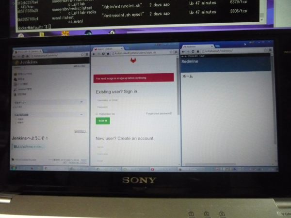
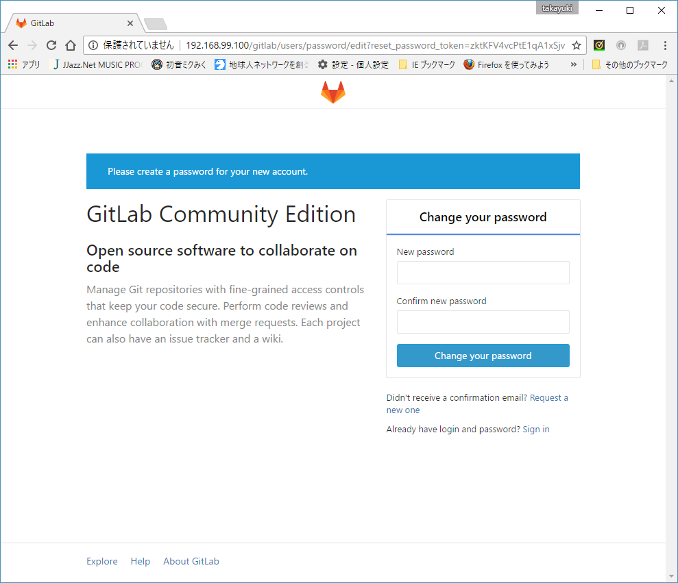

#これはなに？
CIに必要と思われるWebアプリをDockerで立ち上げる環境をつくるシェルスクリプトです。  
Dockerホストからシェルを実行することで、Dockerイメージのダウンロード、Apache HTTP Serverからログインできるまでの環境設定、Dockerコンテナの起動までをシェルで行います。  
以下のWebアプリを使用します。  
- Redmine
- Jenkins
- GitLab(+Redis)
- MySQL
- Apache Http Sserver  

  

###使用するDockerイメージ
- mysql（公式）  
- Jenkins（公式）  
- sameersbn/redmine  
- sameersbn/gitlab  
- sameersbn/redis  
- bitnami/apache  

###確認環境
FMV LIFEBOOK WA3/J（FMVWJA3BA7）
- OS:Windows 8.1 64ビットオペレーティングシステム, X64ベースプロセッサ  
- CPU:Interl(R) Core(TM) i7-3632QM CPU @ 2.20GHz 4コア/8スレッド
- DDR3 SDRAM PC3-12800 8.00GB

###提供ファイル
* **init.sh** : Dockerイメージのダウンロード、Apache HTTP Serverからログインできるまでの環境設定、Dockerコンテナの起動を行う。
* **start.sh** : init.shで作成したDockerコンテナを起動する。（docker startを実行）
* **stop.sh** : init.shで作成したDockerコンテナが起動している場合、停止する。（docker stopを実行）
* **httpd.conf_** : init.shでApache HTTP Serverに設定するコンフィグファイル（コピーするだけ）

## 使い方

1. Docker Toolboxを[Install Docker Machine](http://docs.docker.com/machine/install-machine/)からダウンロードして、インストールする。  

1. Docker Quickstart Terminalを実行して、VMイメージ（default）を作成する。  
docker-machineのコンソールが開きDockerを操作ができる。しかし、このコンソールは使いにくいので、TeraTermを使ってSSHで接続して操作してしまいましょう。  

  これを  
   

  こうして（user/password=docker/tcuser）  
   

  こうじゃ  
   

1. DockerのVMイメージdefaultで設定されている共有フォルダ（/c/Users/）配下のどこかに、init.shを置いて実行する。  
 このシェルを置いたディレクトリの配下に、各APのファイルを格納するディレクトリを作成し、そこでファイルの永続化を行う。  
 （なお、Docker VMイメージはboot2docker.isoというCDイメージなので、マウントしたディレクトリ以外にファイル・ディレクトリを作成してもVMを止めると消えてしまう。そして、マウントの設定もCDイメージに書かれているので、デフォルトのマウント以外は追加できない＝/c/Users/だけしかマウントされない）  

 確認した環境では、c:\Users\<ユーザ>\Documents\docker の配下にinit.shを置いて実行した。  
 init.shの引数で、MySQLのパスワード、RedmineとgitlabのDBパスワード、gitlabのSecure DB Key(64文字)を指定する。
__ Usage : init.sh [mysql password] [redmine DB password] [gitlab DB password] [gitlab security db keybase]__  

 例：`docker@default:~$ /c/Users/<ユーザ>/Documents/docker/init.sh USLXBvbg QjNlvCVI 8V3wPLOi D1TKG2WsPE4mT6JWZEqUaoOhDOLVtflodLjAWZTy7rczIkfGnT7TI8YPSrpNKfCF`

 init.shが作成するディレクトリ（/c/Users/<ユーザ>/Documents/docker/init.shを実行）  

 ```
/c/Users/<ユーザ>/Documents/docker/  
  └─ci  
     ├─apache  
     ├─gitlab  
     ├─gitlab-redis  
     ├─jenkins  
     ├─mysql  
     └─redmine  
  ```
  init.sh を実行して、しばらく待つと最後にApache HTTP Server が起動する。  
  起動直後は安定していないようなので、5分くらい待ってから、Webブラウザからアクセスする。  
  上手くいかない場合は、start.shで止まったDockerコンテナを起動しなおす。  

  各APのURLは以下。
 * gitlab ：http://192.168.99.100/gitlab/  
 * Redmine ：http://192.168.99.100/redmine/  
 * Jenkins ：http://192.168.99.100/jenkins/  

1. Dockerホスト以外のPCからのアクセス  
 Oracle VM VirtualBox マネージャーで、VMを選択して設定ボタンを押す。  
   
 ネットワーク → アダプター1を選択して、▷高度を押下 → ポートフォワーディングボタンを押下。  
   
 httpの設定を追加。ホストIPにそのPC自身のIPアドレス、ホストポート・ゲストポートに80を設定。  
 ※：Dockerが動いているPCの外からアクセスできるようにする設定。なので余計な設定はしないほうが良い。  
 （sshはデフォルトで設定されている。そのPCしか接続しないなら削除したほうが吉）  
   

  以上の設定で、他のPCからWebブラウザで接続できるようになる。（自PCからも外部IPを指定して接続できる）  
  以下の写真は、手前のPCで背後のPCで動作しているDockerにアクセスしている。左からJenkins,gitlab,Redmineを表示。  
   

#### redmine
 上部の「ログイン」を選択肢、userid/password=admin/adminで接続。  
   
   
 adminでログインされました。  
   

#### Jenkins  
 まず初めにJenkinsの管理→「セキュリティを設定」を選択して、セキュリティを有効にする。  
   
 ”リバースプロキシの設定がおかしい”との指摘があれども今は放置。  
   
「セキュリティを有効化」をONにする。他は適当に設定して「保存」を押下。  
   
 サインアップを求められるので適当なユーザ・パスワードを設定。  
   
 次回から作成したユーザでログインする。  
   

#### gitlab
 userid/password=root/5iveL!feで接続。  
   
 rootのパスワードの更新を求められる。適切なパスワードを設定する。  
   
  プロジェクト、グループの登録を行う。  
   


# 覚書
- Docker Toolbox の Docker Quickstart Terminalで作られるVMイメージは、IPアドレスが192.168.99.100で固定。  
 SSH（UserID/Password=docker/tcuser）で接続できる。
- Apache HTTP Server リバースプロキシとして使用している。
 mod_proxy、mod_proxy_http：指定されたURLのパスから区別して、バックエンドサーバに振り分ける。ProxyRequests Off とProxyPass、ProxyPassReverseで設定する。Cookieの転送先バックエンドサーバ、パスの設定も行う。ProxyPassReverseCookieDomain、ProxyPassReverseCookiePathで設定する。  
 mod_proxy_html：CSS、pictなどのリンクを書き換える。ProxyHTMLEnable On、ProxyHTMLURLMapで設定する。  
 Locationディレクティブに設定することで、特定のパスだけに設定を利かせることができる。  
 なお、Jenkinsでパスに/jenkins/を追加しているのでProxyHTMLURLMapとProxyPassReverseCookiePathは不要かもしれない。 ←正解。削除した。  
 Redmineの保存でリダイレクトされない問題は、パスの設定を行えば解決するかもしれない。←正解、RedmineのDockerコンテナにパス設定することで解決した。  

 ```
  LoadFile    /opt/bitnami/common/lib/libxml2.so
  LoadModule  proxy_html_module    modules/mod_proxy_html.so
  LoadModule  xml2enc_module       modules/mod_xml2enc.so
  ProxyRequests Off
  <Proxy *>
  	Order deny,allow
  	Allow from all
  </Proxy>

  <Location /jenkins/>
  	ProxyPass http://ci_jenkins:8080/jenkins/
  	ProxyPassReverse http://ci_jenkins:8080/jenkins/

  	ProxyHTMLEnable On
  #	ProxyHTMLURLMap /jenkins/ /jenkins/

  	ProxyPassReverseCookieDomain ci_jenkins:8080 192.168.99.100
  #	ProxyPassReverseCookiePath /jenkins/ /jenkins/

  	RequestHeader unset  Accept-Encoding
  </Location>

  <Location /redmine/>
  	ProxyPass http://ci_redmine/redmine/
  	ProxyPassReverse  http://ci_redmine/redmine/

  	ProxyHTMLEnable On
  #	ProxyHTMLURLMap / /redmine/

  	ProxyPassReverseCookieDomain ci_redmine 192.168.99.100
  #	ProxyPassReverseCookiePath / /redmine/

  	RequestHeader unset  Accept-Encoding
  </Location>

  <Location /gitlab/>
  	ProxyPass http://ci_gitlab/
  	ProxyPassReverse  /

  	ProxyHTMLEnable On
  	ProxyHTMLURLMap / /gitlab/

  	ProxyPassReverseCookieDomain ci_gitlab 192.168.99.100
  	ProxyPassReverseCookiePath / /gitlab/

  	RequestHeader unset  Accept-Encoding
  </Location>
```
- Oracle VM VirtualBoxを起動したままPC（Windows）を休止状態にすると、ネットワークの接続が不可能になる。  
 ipconfigコマンドで「イーサネット アダプター VirtualBox Host-Only Network #2:」を見ると以下のようになっている。  
 ”自動構成IPｖ４アドレス”と”サブネットマスク”が追加されているのと、”IPｖ４ アドレス”に”（重複）”が付いているのがおかしい。  

 ●休止状態前（接続できる状態）
```
   リンクローカル IPv6 アドレス. . . . .: fe80::9474:5cf:7669:1cf2%20(優先)
   IPv4 アドレス . . . . . . . . . . . .: 192.168.99.1(優先)
   サブネット マスク . . . . . . . . . .: 255.255.255.0
```

 ●休止状態後（接続できない状態）
```
   リンクローカル IPv6 アドレス. . . . .: fe80::9474:5cf:7669:1cf2%20(優先)
   自動構成 IPv4 アドレス. . . . . . . .: 169.254.28.242(優先)
   サブネット マスク . . . . . . . . . .: 255.255.0.0
   IPv4 アドレス . . . . . . . . . . . .: 192.168.99.1(重複)
   サブネット マスク . . . . . . . . . .: 255.255.255.0
```
 Networkアダプタを無効→有効することでまた使えるようになる。  
 管理者権限で以下のコマンドを実行する。Oracle VM VirtualBoxを停止する必要がある。  
```
netsh interface set interface "VirtualBox Host-Only Network" disable
netsh interface set interface "VirtualBox Host-Only Network #2" disable
netsh interface set interface "VirtualBox Host-Only Network" enable
netsh interface set interface "VirtualBox Host-Only Network #2" enable
```

# 既知の問題
### ・redmine
- 個人設定の保存でリダイレクト先に問題あり。/redmine/が付かない。
 → redmineのDockerコンテナに、--env='REDMINE_RELATIVE_URL_ROOT=/redmine'を設定することで、URLに/redmineが付く。これで、恋人設定の保存もOK。（httpd.confの設定も合わせて修正）
